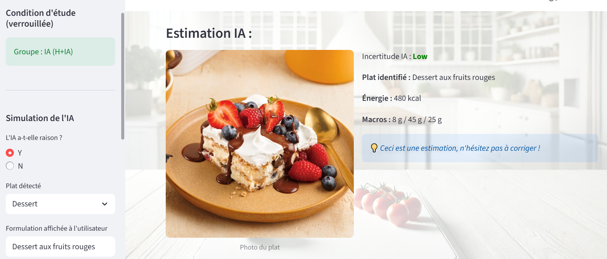

# NutriSnap-HAI 🥗

NutriSnap-HAI est un prototype d’application de suivi nutritionnel conçu pour étudier les interactions Humain–IA dans un contexte d’estimation nutritionnelle à partir d’images.  
Le système vise à assister les utilisateurs (athlètes, femmes enceintes ou personnes soucieuses de leur santé) dans le suivi de leurs apports nutritionnels, tout en maintenant un contrôle humain explicite sur les décisions finales.

---

## 🖼️ Aperçu du prototype



---

## 🚀 Objectif du projet

L’objectif principal de ce projet est de valider une interaction d’identification rapide du repas assistée par IA, tout en mesurant la **Reliance** de l’utilisateur, c’est-à-dire sa capacité à faire confiance au système de manière appropriée.

Bien que la vision globale du projet inclue l’intégration de données biologiques (analyses de sang) et de statuts spécifiques (grossesse, prise de médicaments, profil sportif), ce prototype se concentre volontairement sur la **brique fonctionnelle critique** de l’estimation visuelle du repas.

---

## 🛠️ Fonctionnalités clés – Interaction Humain–IA

Le prototype implémente plusieurs principes de conception issus des recommandations en IA responsable :

- **G2 / G10 – Incertitude actionnable**  
  Affichage d’un badge d’incertitude (*Low*, *Medium*, *High*).  
  En cas d’incertitude élevée (par exemple, image floue), l’IA s’abstient de fournir une estimation et propose une saisie manuelle.

- **G4 – Explicabilité**  
  Justification des estimations à partir des ingrédients détectés dans l’image.

- **G9 – Override utilisateur**  
  L’utilisateur peut accepter (*OK*), ajuster (*ALMOST THERE*) ou rejeter (*NO*) la proposition de l’IA.

- **GF1 – Garde-fou**  
  Après deux échecs consécutifs d’identification, le système bascule automatiquement en mode de saisie manuelle afin d’éviter une automatisation inappropriée.

---

## 💻 Installation et utilisation

### Prérequis
- Python 3.x  
- Bibliothèques Python : `streamlit`, `pandas`

Installation des dépendances :
```bash
python -m streamlit run app.py
```

---

## 💻 Lancement du prototype

Pour exécuter l’application Streamlit, lancez la commande suivante :

    ```python -m streamlit run app.py```

---

## 🧙 Mode *Magicien d’Oz* (WoZ)

Le prototype repose sur une simulation de l’IA afin d’isoler les dynamiques d’interaction.

### Côté utilisateur
- L’utilisateur téléverse une photo de son plat (ex. `boisson_1.jpg`).

### Côté magicien (barre latérale)
- L’expérimentateur renseigne manuellement l'identification du plat, les calories, les macronutriments et le niveau d’incertitude avant d’afficher la réponse simulée de l’IA.

---

## 📊 Analyse des données

Le projet inclut un notebook Jupyter (`NutriSnap_HAI.ipynb`) permettant d’analyser les traces d’interaction enregistrées dans `logs.csv`.

Les analyses portent notamment sur :
- Le **score de Reliance** (0,28 dans cette étude), indiquant une confiance modérée et critique envers l’IA.
- Le **gain de performance** (temps de décision) entre la condition *Humain seul* (`H_only`) et la condition *Humain + IA* (`H+IA`).
- L’impact de l’**incertitude** et de l’**explicabilité** sur le comportement et la prise de décision des utilisateurs.

---

## 📂 Contenu du dépôt

- `app.py` : Code source du prototype Streamlit  
- `logs.csv` : Données d’interaction collectées  
- `NutriSnap_HAI.ipynb` : Analyses statistiques et visualisations
- `Dataset` : Dossier contenant les images à téléverser  
- `Docs` : Documents détaillant le sujet, les guidelines et le protocole expérimental et les résultats du prototype
